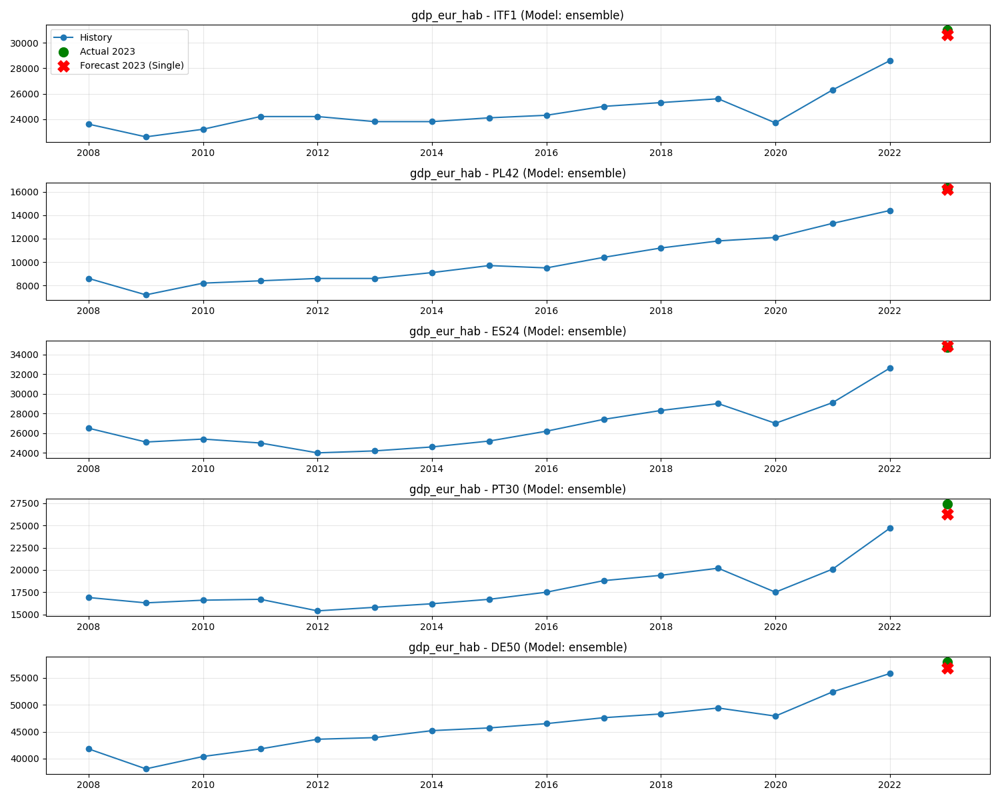
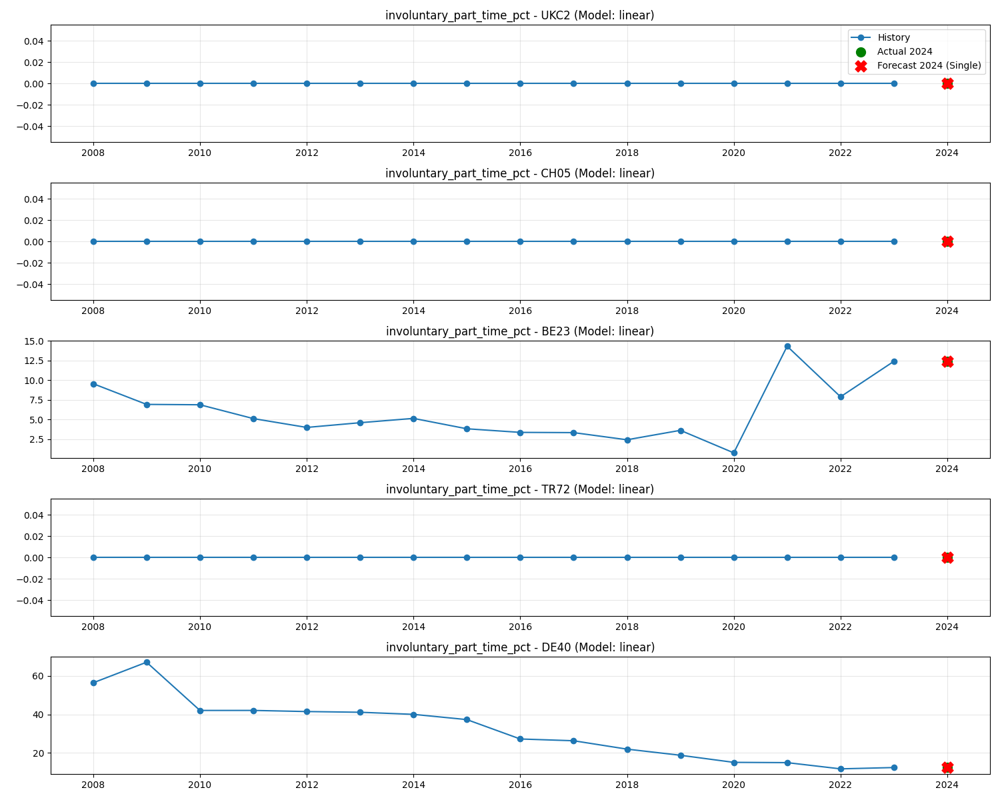
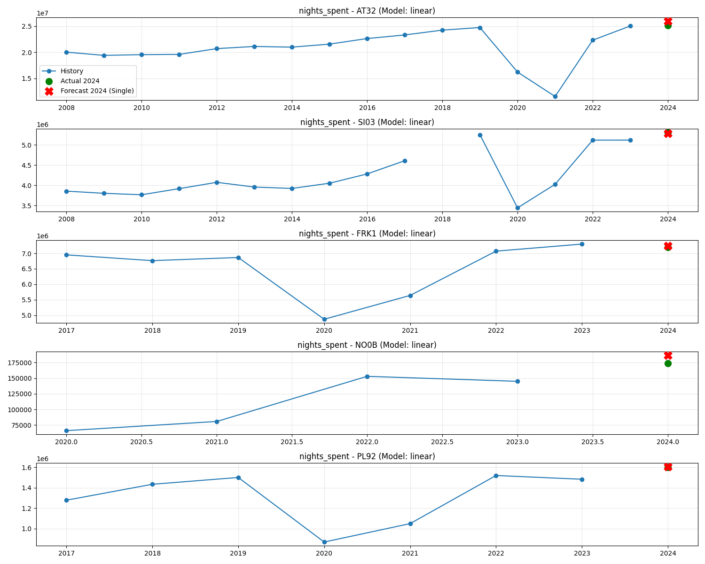
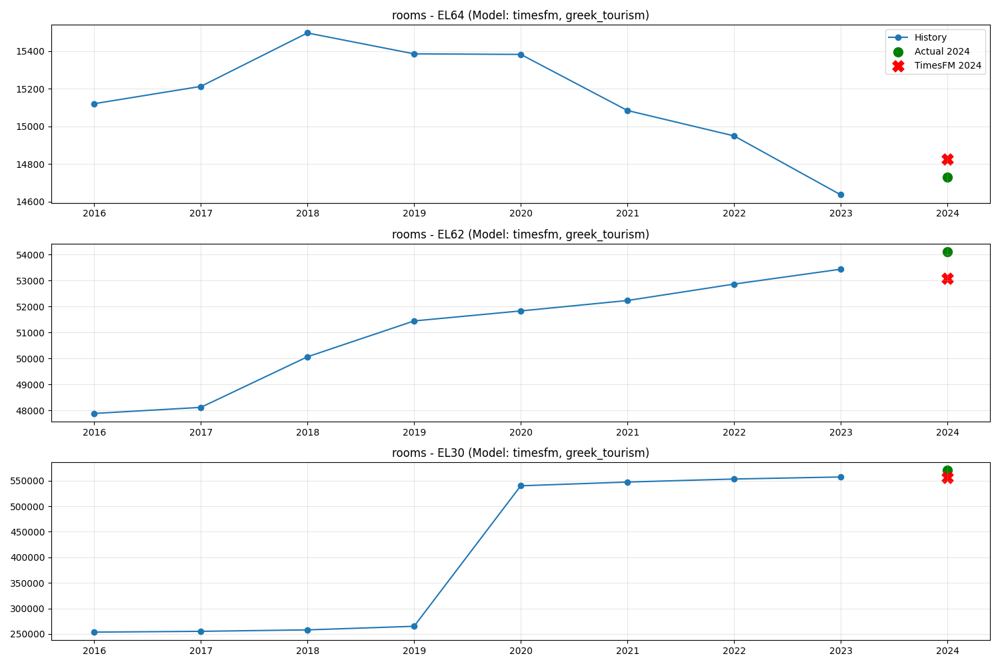

# Eurostat Regional Forecasting Framework

This project provides a comprehensive machine learning pipeline designed to forecast regional economic and social indicators across Europe at the NUTS 2 level. The framework covers the entire lifecycle: from multi-domain data extraction to comparative model evaluation and production deployment through FastAPI.

---

## 1. Data Sourcing & Thematic Domains

Data is sourced from the official **Skillscapes Eurostat Wrapper API**, providing structured regional indicators for EU member states and candidate countries. The project is organized into four thematic domains:

- **Economy**: Key indicators including GDP (Mio EUR), GDP per Inhabitant (EUR), Gross Fixed Capital Formation (GFCF), and sectoral Gross Value Added (GVA) across 10 standard sectors.
- **Labour Market**: Employment and unemployment rates, NEETs (Youth), sectoral employment distributions, and educational/skill levels (ISCO).
- **General Tourism**: Regional tourism capacity and activity, including arrivals, nights spent, bed spaces, and establishmets.
- **Greek Tourism**: A specialized dataset for Greek regions covering hotel Arrivals/Overnights (domestic vs foreign), turnover in accommodation/catering services, and regional capacity metrics.

**Temporal Coverage**: Historical data typically spans from **2008** to the most recent available year (e.g., 2023 for Economy, 2024 for Labour/Tourism).

---

## 2. Preprocessing & Data Quality Engine

The preprocessing engine transforms raw Eurostat data into a robust format for time-series forecasting across approximately 400 regions:

- **Wide-Format Transformation**: Long-format Eurostat data is pivoted into a cross-sectional wide structure where each row represents a unique **Region (`geo`)** and columns are flattened to **`Indicator_Year`** (e.g., `gdp_mio_eur_2010`).
- **Feature Matrix Preparation**: During training, the **`geo`** column is treated strictly as a unique index and is **dropped** from the input feature matrix to prevent the models from "memorizing" specific regional IDs. Only numeric temporal lags are used for prediction.
- **Linear Interpolation**: To address historical data gaps (missing years within a series), **linear interpolation** is applied across consecutive years. This ensures models process continuous trends.
- **Static Data Handling**: For indicators with low temporal variance (e.g., "Land Area"), logic is implemented to detect zero-variance histories and override model noise with constant value extensions.
- **Imputation Strategy**: Remaining missing values are addressed via regional averages or a final zero-fill fallback for system stability.

---

## 3. Forecasting Methodology

A **Cross-Regional Training** strategy is utilized. Rather than training isolated models for each region, a single global instance is trained for each indicator across **all regions simultaneously**. This captures broader economic cycles and cross-regional dependencies.

### A. Phase 1: Feature Set Comparison (Single vs. Multi)
For every model architecture evaluated, the system performs a primary comparison between two feature sets to determine the optimal input scope for each specific indicator:

- **Single-Feature Forecast**: The model uses **only** the historical lags of the target indicator (e.g., using previous GDP years to predict current GDP). This is effective for indicators with strong, independent self-correlation.
- **Multi-Feature Forecast**: The model utilizes the lags of the target indicator **plus** the lags of all other indicators in that domain (e.g., using Employment and Sectoral GVA history to predict GDP). This captures inter-variable economic drivers.

### B. Phase 2: Model Tournament & Winner Selection
The framework employs a "hierarchical selection" process to identify the most accurate production model:
1. **Intra-Model Selection**: For each model class (e.g., XGBoost, Ridge), the MAPE of the *Single-Feature* version is compared against the *Multi-Feature* version. The superior version is retained as the "Model Candidate."
2. **Inter-Model Tournament**: The Candidates from all model classes (Ridge, XGBoost, TimesFM, Ensemble) are compared against one another.
3. **Winner Assignment**: The entry with the overall lowest MAPE across the 20% regional test set is crowned the **Winner** and exported for production.

### C. Predictive Models
The framework evaluates four primary architectures:
1. **Linear Regression (Ridge)**: Employs L2 regularization to manage multi-feature dimensionality and prevent overfitting.
2. **XGBoost**: Gradient Boosting Decision Trees optimized with the `reg:absoluteerror` objective for robustness against outliers.
3. **TimesFM (Foundation Model)**: Google's 2.5 Billion parameter Time-Series Foundation Model, integrated via a custom regional wrapper.
4. **Ensemble**: A meta-model that averages predictions from Ridge and XGBoost to reduce predictive variance.

### D. Evaluation Strategy (Phase 1)
Accuracy is measured by selecting the most recent year with ground truth (the **Evaluation Year**) and splitting the regions:
- **Training Set (80%)**: Used to train the model and learn regional patterns.
- **Test Set (20%)**: Retained as unseen data to evaluate performance. The **MAPE (Mean Absolute Percentage Error)** on this set determines the "Winner" for each indicator.
- **Visualization Examples**: The following plots demonstrate the system's performance on the 20% regional test group, where the **Actual Value (Green Dot)** is compared against the **Forecasted Value (Red X)**.

#### Example 1: GDP per Inhabitant (Economy Domain)
The following plot demonstrates the performance for `gdp_eur_hab`. During the **Model Tournament**, the **Ensemble** architecture (averaging Ridge and XGBoost) emerged as the winner. Specifically, the **Single-Feature** version achieved a superior MAPE of **3.02%**, outperforming the Multi-Feature configuration. This indicates that historical GDP trends are the primary drivers for this indicator.

#### Example 2: Involuntary Part-Time Employment % (Labour Domain)
For the `involuntary_part_time_pct` indicator, the **Model Tournament** identified the **Linear Regression (Ridge)** architecture as the winner. In this instance, the **Single-Feature** configuration achieved a near-perfect MAPE of **0.00%** (specifically 0.002%), demonstrating exceptional precision in capturing the stable historical patterns of this specific metric.

#### Example 3: Nights Spent at Tourist Establishments (Tourism Domain)
For the `nights_spent` indicator, the **Linear Regression (Ridge)** model with a **Single-Feature** configuration was identified as the winner. It achieved a MAPE of **4.01%**, successfully navigating the significant temporal volatility and seasonality common in regional tourism data.

#### Example 4: Number of Rooms (Greek Tourism Domain)
The specialized Greek Tourism dataset benefits significantly from foundation models. For the `rooms` indicator (regional hotel capacity), **TimesFM** outperformed classical models. By processing each series independently with its 2.5B parameter transformer, it achieved a high-precision MAPE of **1.69%**.

### E. Deployment & Inference (Phase 2)
The production environment uses the **Winners** identified in the evaluation phase:
- **Deployment Training**: Models are not "frozen" at the 80% mark. Instead, the `src/export_models_to_api.py` script performs a final training pass on **100% of available regional data**. 
- **Data Utilization**: By training on the full dataset, the model "swallows" the previously hidden 20% ground truth, ensuring the production model is as informed as possible before forecasting the future.
- **Inference**: The FastAPI service uses these pre-trained `.pkl` snapshots. When triggered, it performs high-speed inference to predict the **Next Year** (Year T+1), for which no ground truth yet exists.

---

## 4. Performance Metrics

Models are benchmarked using a multi-metric approach:
- **Primary Metric**: MAPE (Mean Absolute Percentage Error).
- **Secondary Metrics**: MAE (Mean Absolute Error), RMSE (Root Mean Squared Error), and R² (Coefficient of Determination).

The configuration (model type + feature set) achieving the lowest MAPE for a specific indicator is automatically selected for deployment to the production API.

---

## 5. Production Infrastructure (FastAPI & Docker)

The service is fully containerized and integrated with a document-oriented database for scalability.

### A. Components
- **FastAPI**: Serves as the high-performance application layer.
- **MongoDB (`skillscapes` DB)**: Centrally stores both historical data (`type: "history"`) and generated predictions (`type: "forecast"`) within domain-specific collections.
- **Docker**: Simple deployment via `docker-compose.yml`.

### B. Automated Operations
The API automates the data lifecycle:
1. **`POST /data/update`**: Orchestrates the ETL process (Download -> Wide Pivot -> Interpolate -> MongoDB Update).
2. **`POST /forecast/run`**: Performs zero-retraining inference using pre-trained models on the most recent MongoDB data.
3. **`GET /forecast/{domain}`**: Provides instant JSON access to regional forecasts.

---

## 6. Project Execution Guide

1. **Experimental Benchmarking**: Execute scripts in `src/` to view MAPE comparisons and performance plots in `results/`.
2. **Model Deployment**: Execute `python src/export_models_to_api.py` to train and export the winning models to the API.
3. **Service Activation**: Deploy via Docker: `docker-compose up --build`.

## After deployment, the forecasts are interactively plotted here: [Yearly Eurostat Forecasts per NUTS 2](https://eurostatforecasts.streamlit.app/). When data are updated, the plots are automatically updated according to the pretrained models.
